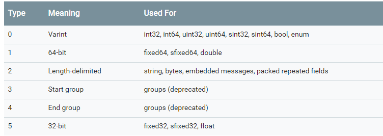
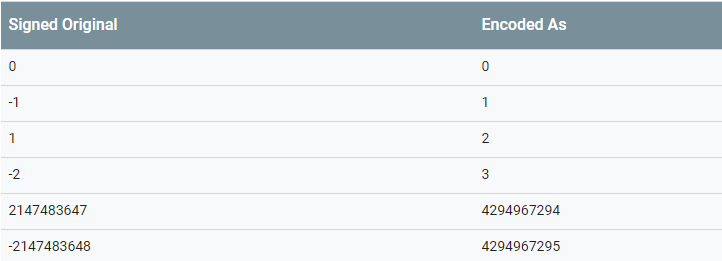

## protocol buffer encoding入门

protocol 主要的优势在于减少序列化的数据大小，加快数据在网络传输过程中的速度，那么protocol如何进行序列化，如何进行编码就很关键。

### 1. 简单案例

	message Test {
		optional int32 age =1;
	}

	如果设置age为150，这序列化的数据为三个字节 08 96 01

为什么被序列化为08 96 01？

### 2. Base 128 Varints

**base 128 varints**是一种可变长度编码，varints可以用一个或者多个字节来表示一个整数，通常来说，数据类型的长度只是根据操作系统位数来确定，例如int32如果用4个字节表示，当整数数值为小整型的时候，只需要一个字节就能表示，但是不采用可变整型时，高位必须用0来填充，这种属于无效数据，只会增加报文的长度。

通常来说，对于一种自描述编码方式，需要具备T（type，类型）、L（length 长度）、V（value，值）、S（splitor 分割）的能力。如何使用最简短的报文来表达这些信息就是一个编码协议的优劣的关键。

#### 2.1 原理

每个字节都最高位（msb：most significant bit）表示是否后续还有更多的字节用于拼接，低的7个字节用于拼接形成真正的数值，注意是**最小影响的组在左，即低位数值在左。**。

例如300的bit为0000 0001 0010 1100，那么采用base 128编码后为 1010 1100 0000 0010。

过程：

	1010 1100 0000 0010
	->000 0010 ++ 010 1100 (去掉msb位以及调换高低位顺序)
	-> 1 0010 1100 = 300

### 3.消息结构

protobuff是由key-value键值对组成，key的组成方式规则为 (field_number << 3)|wire_type,
其中，wire_type的值定义如下：

如果type为0，则表示使用可变整型来表示，即参考上述的base 128描述。

回顾第一个例子：

key为： 1<<3 | 0 = 00001000, 值 150（1001 0110）的base 128模式为： 10001 0110 0000 0001，拼接到一起：key：0000 1000， value：10001 0110 0000 0001，对应的16进制形式为08、96、01

### 4. 更多的数据类型

#### 4.1 有符号整数

对于有符号整数：sint32，sint64等，对应的可变整型先采用ZigZag进行编码，在采用base 128进行编码，

ZigZag 编码如下：

#### 4.2 非可变整型数值

参考type描述，double以及fixed64为type为1， float以及fixed32的type为5.数据存储采用little-endian byte order,即为**小端序**（低字节在前，高字节在后）。

#### 4.3 Strings 

string的编码很简单，type为2 | field_number, 后面接字符串的的长度，再接对应字符ASCII编码。

例如：

	message Test {
		optional string x = 2;
	}
	
	设置x为"abc",那么对应的编码为
	12 03 61 62 63

#### 4.4 Embedded Messages

嵌套消息对象，嵌套消息对象的wire type为2，嵌套的对象会作为bytes跟在长度后面，怎个处理方式与string类似。结合以前案例，

示例：

	message Test1 {
		message Test {
			optional int32 age =1;
		}
		optional Test c = 3；
	}	

	如果将age设置为150，这序列号的数据为1a 03 08 96 01

#### 4.5 Optional And Repeated Elements

可选以及重复元素

示例：
	
	message Test {
		repeated int32 x = 1 [packed=true]
	}

proto2针对repeated字段，有个可选项packed=true/false,在proto3中，重复字段默认设置为packed=true。此字段的含义为，该字段的所有值被序列化一个值，wire type为2，即length-delimited。

	如果给上值依次设置为1,30， 280，则最终序列化数据为：
	1的varint为 01
	30的varint为1E
	300的varint为 AC 02
	长度为：04
	索引与包装类型为：0A
	序列化的数据为：0A 04 01 1E AC 02

#### Field Order

编写.proto文件时，对字段顺序没有要求，但是在序列化时候必须按照字段顺序来，因为在解析时，依赖字段顺序做了相应优化。

对于未知字段，Java与C++，先按照字段顺序写入已知字段后，再按照任意顺序写入未知字段，而当前的python则没有处理未知字段。